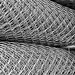
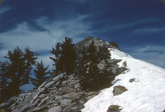

*The topmost rows of each algorithm indicate the max accuracy obtained on the testing set*
# K-Nearest Neighbour
The parameters that provided the best accuracy are as follows:   

| Strategy      | Neighbours    | Batch-size  | Accuracy(%) | Running Time(seconds) |
| ------------- |:-------------:| -----------:|------------:| ---------------------:|
| **Euclidean     | 55            | 1000        | 71.36       | 6.96**               |
| Euclidean     | 100           | 1000        | 70.30       | 8.34                  |
| Euclidean     | 100           | 100         | 70.30       | 7.17                  |
| Euclidean     | 3             | 1000        | 68.7        | 6.88                  |

As we can see here, that increasing the number of neighbours improves the accuracy. I would suggest a batch size of 1000 and 55 nearest neighbours. 

To Run:

./orient.py train train-data.txt knn_model.txt nearest

./orient.py test test-data.txt knn_model.txt nearest

Incorrectly classified images  

    
  

As we can see here, these images are difficult to classify even for us as the pixel intensities accross the image is constant. Thus, a the network could not distinguish between the photos.  
Correctly Classified  
    
  

*We could not upload the trained model for KNN as its size exceeded 100 MB*
# Neural Networks

### suported/configurable features
- Activation fucntions: Relu, Sigmoid, Softmax
- Loss: Categorical Cross Entropy
- Gradient Descen optimazation using RMSProp (if set to True)

**Architecture: (Best) 

In this we have used 4 layers. 

| Layers        | Activation function 
| ------------- |:-------------------:
| Layer 0       | relu                
| Layer 1       | relu              
| Layer 2       | relu                
| Layer 3       | softmax             

RMSProp is set to False for all below runs.

| learning rate  | Epoch| Accuracy(%) | Running Time(seconds) | Batch Size
| --------------:|-----:|------------:| ---------------------:|-----------:|
|   **  0.0005     |  100 | 72.6       | 0.13                  |     1
|     0.00005    |  80  | 68.61       | 0.145                 |    128
|     0.000005   | 150  | 66.17       | 0.12                  |   128

To Run:  ./orient.py test test-data.txt nnet_model.txt nnet

Incorrectly classified images  

    
  

As we can see here, these images are difficult to classify even for us as the pixel intensities accross the image is constant. Thus, a the network could not distinguish between the photos.  
Correctly Classified  
    
  

# Decision Tree

| Max - Depth   | Minimum- leaves |  Accuracy(%) | Running Time(seconds) |
| ------------- |:---------------:| ------------:| ---------------------:|
| **10            | 10              |    67.23     | 3.96**                  |
| 100           | 2               |    62.56     | 9.34                  |
| 200           | 100             |    58.66     | 8.16                  |
| 15            | 76              |    60.87     | 1.58                  |

To Run:  ./orient.py test test-data.txt tree_model.txt tree

Incorrect classification  

    
  

Correct classification  

    
  

Our best model is using neural network which gives us the accuracy of 72.6% with learning rate 0.0005 and 100 epochs. We would recommend this.
